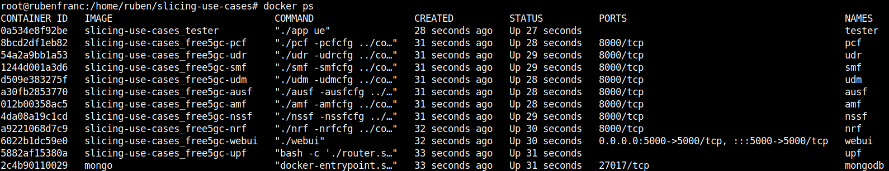
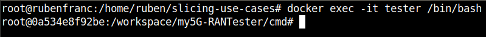

# my5G-my5G-RANTester-docker-v3.0.6
This repository is a docker compose version of my5G-core(free5gc stage 3 version v3.0.6) and my5G-RANTester(a gNB/UE simulator)

## Prerequisites

### GTP5G kernel module

Due to the UPF issue, it should contain gtp5g kernel module with kernel version 5.4.90-050490-generic.

On you host OS before running containers execute:

```
git clone -b v0.4.0 https://github.com/free5gc/gtp5g.git
cd gtp5g
make
sudo make install
```

### Docker engine

To install docker on your favorite OS, you can follow instruction here: https://docs.docker.com/engine/install

### Docker compose

You also need to install docker compose as detailed here: https://docs.docker.com/compose/install/

## Start free5gcore v3.0.6 and my5G-RANTester(a gNB/UE simulator)

```
https://github.com/my5G/my5G-RANTester-docker-v3.0.6.git
cd my5G-RANTester-docker-v3.0.6/
make base
docker-compose build
sudo docker-compose up -d
```

You can check the environment using docker command:

```
docker ps
```

<div align="left">

</div>


You can access the tester using docker command:
```
docker exec -it "container id that running Tester" /bin/bash
```

<div align="left">

</div>
